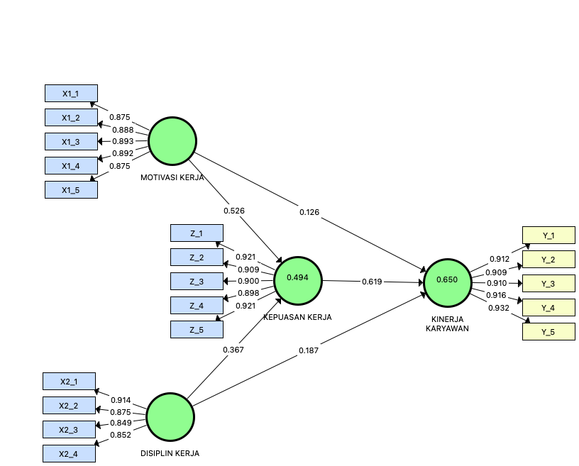
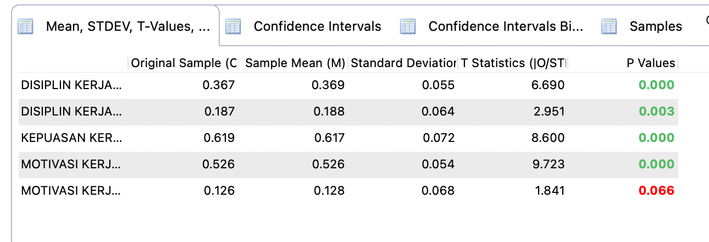
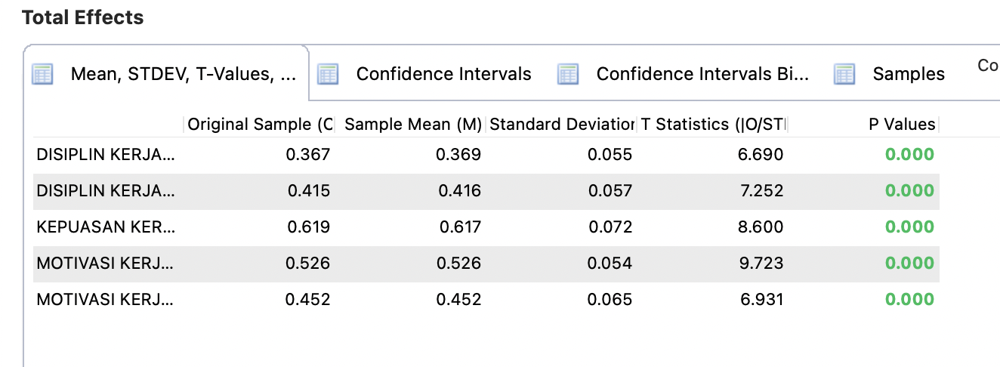

# 📊 SEM-PLS — Motivasi Kerja, Disiplin Kerja, Kepuasan Kerja & Kinerja Karyawan

## Project Overview

Project ini merupakan analisis **Structural Equation Modeling – Partial Least Squares (SEM-PLS)** untuk menganalisis hubungan antara:

- **Motivasi Kerja (X1)**
- **Disiplin Kerja (X2)**
- **Kepuasan Kerja (Z)**
- **Kinerja Karyawan (Y)**

Dalam model ini, **Kepuasan Kerja (Z)** ditempatkan sebagai variabel yang berada di antara Motivasi Kerja dan Disiplin Kerja terhadap Kinerja Karyawan.

## Model Penelitian

Model struktural yang digunakan menggambarkan hubungan:

- Motivasi Kerja → Kepuasan Kerja
- Disiplin Kerja → Kepuasan Kerja
- Motivasi Kerja → Kinerja Karyawan
- Disiplin Kerja → Kinerja Karyawan
- Kepuasan Kerja → Kinerja Karyawan

## Dataset

Dataset terdiri dari:

- **135 responden**
- **20 kolom**
- 1 kolom nomor responden (`NO`)
- 5 indikator Motivasi Kerja (`X1_1`–`X1_5`)
- 4 indikator Disiplin Kerja (`X2_1`–`X2_4`)
- 5 indikator Kepuasan Kerja (`Z_1`–`Z_5`)
- 5 indikator Kinerja Karyawan (`Y_1`–`Y_5`)

Dataset disediakan dalam format CSV.

## Measurement Model — Outer Loading

### Motivasi Kerja (X1)

| Indikator | Outer Loading |
|---|---:|
| X1_1 | 0.875 |
| X1_2 | 0.888 |
| X1_3 | 0.893 |
| X1_4 | 0.892 |
| X1_5 | 0.875 |

### Disiplin Kerja (X2)

| Indikator | Outer Loading |
|---|---:|
| X2_1 | 0.914 |
| X2_2 | 0.875 |
| X2_3 | 0.849 |
| X2_4 | 0.852 |

### Kepuasan Kerja (Z)

| Indikator | Outer Loading |
|---|---:|
| Z_1 | 0.921 |
| Z_2 | 0.909 |
| Z_3 | 0.900 |
| Z_4 | 0.898 |
| Z_5 | 0.921 |

### Kinerja Karyawan (Y)

| Indikator | Outer Loading |
|---|---:|
| Y_1 | 0.912 |
| Y_2 | 0.909 |
| Y_3 | 0.910 |
| Y_4 | 0.916 |
| Y_5 | 0.932 |

## R-Square

| Variabel | R-Square |
|---|---:|
| Kepuasan Kerja (Z) | 0.494 |
| Kinerja Karyawan (Y) | 0.650 |

## Direct Effects — Bootstrapping

| Hubungan | Original Sample | T-Statistics | P-Values |
|---|---:|---:|---:|
| Disiplin Kerja → Kepuasan Kerja | 0.367 | 6.690 | 0.000 |
| Disiplin Kerja → Kinerja Karyawan | 0.187 | 2.951 | 0.003 |
| Kepuasan Kerja → Kinerja Karyawan | 0.619 | 8.600 | 0.000 |
| Motivasi Kerja → Kepuasan Kerja | 0.526 | 9.723 | 0.000 |
| Motivasi Kerja → Kinerja Karyawan | 0.126 | 1.841 | 0.066 |

## Total Effects — Bootstrapping

| Hubungan | Total Effect | T-Statistics | P-Values |
|---|---:|---:|---:|
| Disiplin Kerja → Kepuasan Kerja | 0.367 | 6.690 | 0.000 |
| Disiplin Kerja → Kinerja Karyawan | 0.415 | 7.252 | 0.000 |
| Kepuasan Kerja → Kinerja Karyawan | 0.619 | 8.600 | 0.000 |
| Motivasi Kerja → Kepuasan Kerja | 0.526 | 9.723 | 0.000 |
| Motivasi Kerja → Kinerja Karyawan | 0.452 | 6.931 | 0.000 |

## Catatan Interpretasi

Output menunjukkan adanya perbedaan antara **direct effect** dan **total effect** pada beberapa hubungan.

Sebagai contoh:

**Motivasi Kerja → Kinerja Karyawan**

- Direct effect = **0.126**
- P-value = **0.066**
- Total effect = **0.452**
- P-value = **0.000**

Project ini mendokumentasikan hasil yang terlihat pada output SEM-PLS yang tersedia.

Kesimpulan khusus mengenai **mediasi** belum dicantumkan karena output **Specific Indirect Effects** belum tersedia.

## Files

| File | Keterangan |
|---|---|
| `data-sem.csv` | Dataset penelitian |
| `pls-sem.splsm` | File project/model SEM-PLS |
| `model-sem-pls.png` | Visualisasi model SEM-PLS |
| `bootstrapping-direct-effects.png` | Output Direct Effects |
| `bootstrapping-total-effects.png` | Output Total Effects |
| `README.md` | Dokumentasi project |

## Tools & Metode

- SmartPLS
- Structural Equation Modeling (SEM)
- Partial Least Squares (PLS)
- Bootstrapping
- Outer Loading
- R-Square
- Direct Effects
- Total Effects

## Portfolio

Project ini merupakan bagian dari portfolio:

**SPSS / SEM-PLS — Statistical Analysis**
